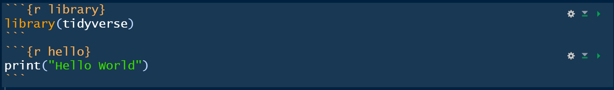

<!-- README.md is generated from README.Rmd. Please edit that file -->

```{r, echo = FALSE}
knitr::opts_chunk$set(
  collapse = TRUE,
  comment = "#>",
  fig.path = "READMEfigs/",
  cache = TRUE,
  message = FALSE,
  warning = FALSE
)
```

# lazytype


The R package *lazytype* provides addins for inserting code and running code in a different manner, and functions to allow interaction between scripts and between script and rmarkdown file.

## Installation

The **stable** version on R CRAN is coming soon.

You can install the **development** version from [Github](https://github.com/FinYang/lazytype) with:

```{r gh-installation, eval = FALSE}
# install.packages("devtools")
devtools::install_github("FinYang/lazytype")
```

## Usage

### Keep the PC awake

`dont_sign_me_out(hours = 3.5)` moves mouse every 5 minutes for a certain time (default 3.5 hours) and print the time elapsed in the console. It is mainly used on public PC where it signs you out for a certain period of inactivity.

### LazyScript

`LazyScript` operations helps with interacting with scripts and rmarkdown files, saves time to copy and paste and provides means to arrange code in a different way.


```{r eval = FALSE}
# test.R
## ---- library ----
library(tidyverse)
## ---- hello ----
print("Hello World")

```

```{r eval = FALSE}
library(lazytype)
script_test <- read_script("test.R", library = TRUE)


```

```{r eval = FALSE}
script_test %run% "hello"
```

```{r echo = FALSE}
print("Hello World")
```

`read_script` provides a `knitr::read_chunk` equivalent in script files.

```{r eval = FALSE}
copy_script_to_rmd("test.R", "test.Rmd", match_chunk = FALSE)
```

```{r echo = FALSE}

```


### Addins

The package provides various addins, aiming to decrease keystrokes and clicks. A complete usage of addins please consult vignette.

* Run All up to Cursor

* Run Selected Arguments

* Insert Purl Section


* Insert Rmarkdown Chunk (Edit Label)

* Insert Scoping Assignment Operator


## License

This package is free and open source software, licensed under GPL-3.
